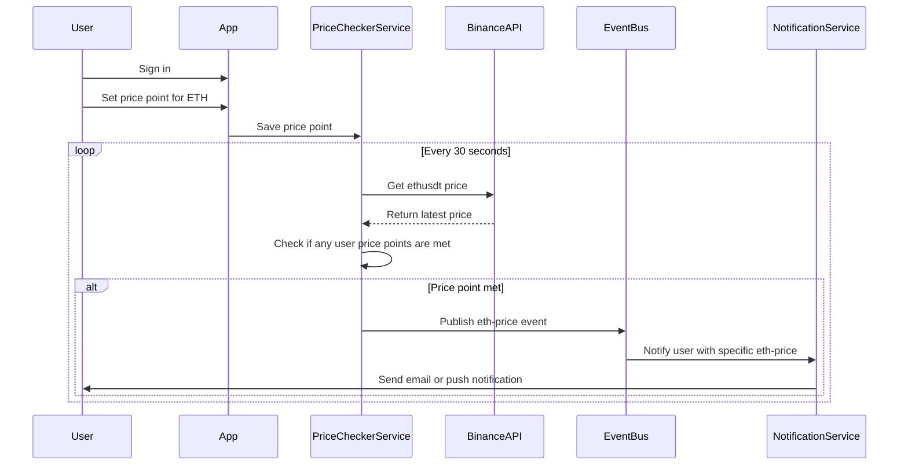

# My Eth App

# Architecture

## Setup

1. Start the Keycloak server in a local Docker container by navigating to `/src/main/docker/keycloak` and running `docker-compose up` in the terminal - this will start a Keycloak server on `http://localhost:8084/admin`

- Then, create a new realm that matches the `quarkus.oidc.auth-server-url` value realm suffix
- Inside the new realm, you can create new users and define authentication and authorization config. Make sure to set the `valid redirect URIs` field to `http://localhost:8080/*` and the `web origins` to `http://localhost:8080`
- To sign in to the Account view, as a user, go to `http://localhost:8084/realms/myrealm/account`
- Thanks to `quarkus-keycloak-authorization` we can set roles/permissions in the keycloak admin console which abstracts the authorization logic AWAY from the application code.
- Users are created **manually** via the admin console in keycloak.

## Authentication

The Authenticaiton flow is:

1. Keycloak server is started
2. Quarkus dev server is started
3. User signs in and gets redirected to Keycloak's registration UI
4. On success, they are redirected back to my-eth-app

## Binance API & Price Points

Currently, I am just calling the binance API directly, without using the binance-connector SDK. I originally wanted to use websockets (hence the SDK), but figured simply querying the `ethusdt` endpoint on a scheduled task was more effective.

The `PriceCheckerService` has a scheduled job every 30 seocnds to ge theprice of ethereum and checks against all price points set by all users. These price points are set on server initialization, but ideally would fetch from DB either every 30 seconds or every hour.

If a user's price point is hit (price point < eth price), then this is published to the event bus via `PricePointEvent` and the user would be notified.

**Note**: The notification service logic for emailing/push notifications is not implemented - and requires production enviornment to do so.

## Swagger

Swagger-UI can be found at `http:localhost:8080/q/swagger-ui`

## TODO:

## Azure Kubernetes Service (AKS)

Deploy the Quarkus, Keycloak and MongoDB containers via the Azure Kubernetes Service for learning and orchestration of all apps and backing services.

1. Finish `docker-compose.yml` file in `src/main/docker/kubernetes` directory
2. Test locally via Docker desktop multi-platform images (MacOS works with ARM architecture, Azure works with AMD architecture)
3. Crate github action to deploy to kubernetes
4. Confirm everything works as intended

Finish this after focussing on React Native CLI from 17/06/24 until 21/06/24 if no other priorities arise. Else, get back to it at a later date.
