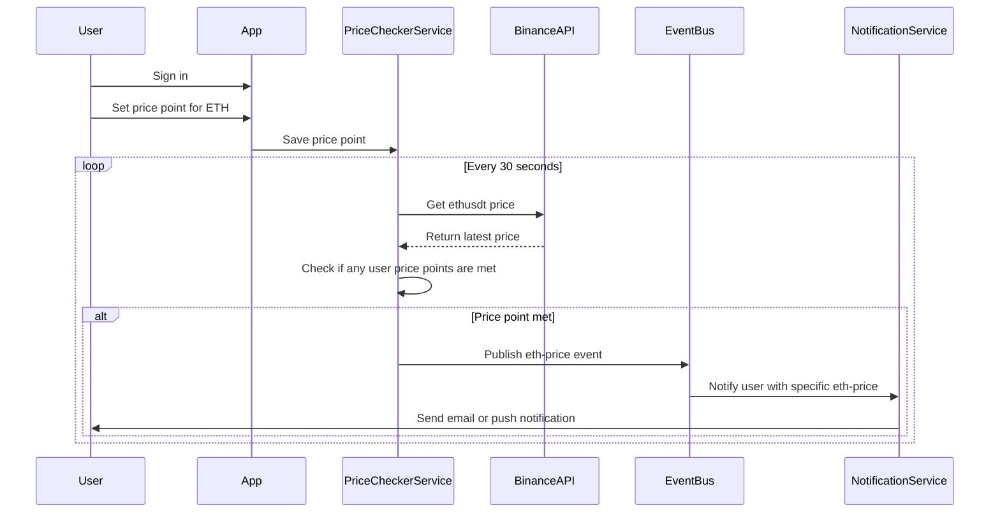

# My Eth App

# Architecture

## Dev notes

1. Start the Keycloak server in a local Docker container by navigating to `/src/main/docker/keycloak` and running `docker-compose up` in the terminal - this will start a Keycloak server on `http://localhost:8084/admin`

- Then, create a new realm that matches the `quarkus.oidc.auth-server-url` value realm suffix
- Inside the new realm, you can create new users and define authentication and authorization config. Make sure to set the `valid redirect URIs` field to `http://localhost:8080/*` and the `web origins` to `http://localhost:8080`
- To sign in to the Account view, as a user, go to `http://localhost:8084/realms/myrealm/account`
- Thanks to `quarkus-keycloak-authorization` we can set roles/permissions in the keycloak admin console which abstracts the authorization logic AWAY from the application code.

The flow is:

1. Keycloak server is started
2. Quarkus dev server is started
3. User signs in and gets redirected to Keycloak's registration UI
4. On success, they are redirected back to my-eth-app

- In the `/callback` method , the user is saved into MongoDB

## TODO:

- OIDC needs to be implemented with RBAC. Currently, the endpoints are not secured (maybe cause localhost) and so anyone can call them. Even though, in the Keycloak console I have created permissions and assigned them to the appropriate resources - perhaps there's a mapping issue going on somewhere. Anyway, move on to Websockets & Events for rest of the day & study OIDC implementation tonight.
